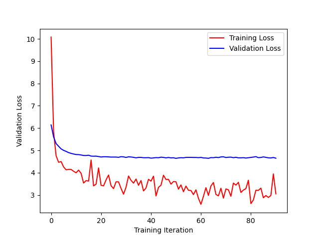

# Examplar Generandi Praeexercitum 

Examplar Genearndi Praexercitum is a Latin literal translation of Pretrained Generative Model (or at least, the best translation I could force. ;D Literally it would be "Pretrained Model of Generating"). This repo contains the code (training scripts, data pipelining, etc.) for my personal crack at making a GPT for Latin.

This project took lots of reference from [minGPT](https://github.com/karpathy/minGPT) and [nanoGPT](https://github.com/karpathy/nanoGPT), which were not only useful, but very fun repos to look through, so a huge shoutout to Andrej Karpathy and his team! That said I've reimplemented everything on my own for the sake of learning PyTorch and the transformer architecture better, making changes however I wish.

I've gone through a number of sources for the dataset, but have currently settled on [this one on huggingface](https://huggingface.co/datasets/Fece228/latin-literature-dataset-170M) which is derived from the [Corpus Corporum](https://mlat.uzh.ch/). (Yes, presently hopping between datasets has left something of a mess in the data setup and loading... I'm working on cleaning that up.) 

Here's a sample of what the training loss has looked like up until my best current iteration. I use Seneca's Moral Epistles as validation data, in part because I find them to be clean, standard Latin, and in part because they're of some personal significance. nanoGPT got all the way down to 2.905 validation loss, so maybe with some better tuning or more training we can get down there too, but we also don't have the same quantity of training data for Latin so maybe not.

And here's a sample of output from near that best-loss point in time, with the prompt bolded:

> **gallia est omnis diuisa in** tres partes. sed quia hoc non est nisi secundum rationem, ideo in diuisione totius est diuisio totius. unde cum in diuisione totius accipiatur totum et pars, diuisio est

> **arma uirumque cano**? et quid mederides? non memnonis ira, non medonii pietas, non memnonis ira, non medeae

> **roma est**. de qua dicit apostolus, rom. 5: si habuero omnem fidem, charitatem autem non habuero, nihil sum. et postea dicit apostolus, hebr.

> **ego** ego sum deus, qui te feci, qui te creaui, qui te illuminaui, qui te adiuui, teque in omnibus conseruaui. o

> **ita fac: uindica te tibi, et tempus quod adhuc aut auferebatur aut subripiebatur aut excidebat collige et serua. persuade tibi hoc sic esse ut scribo:** sic enim et scribo. sed quia sic scripsi, non te rogo ut intellegas: nam et ego te diligo. noli, quaeso, te sic amare

